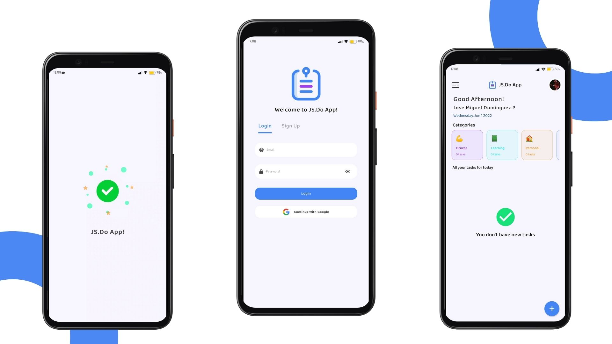
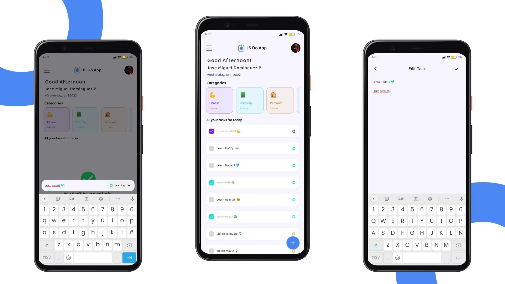
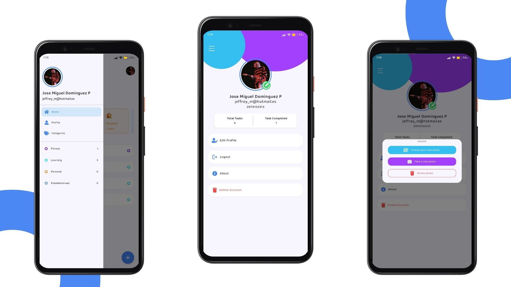
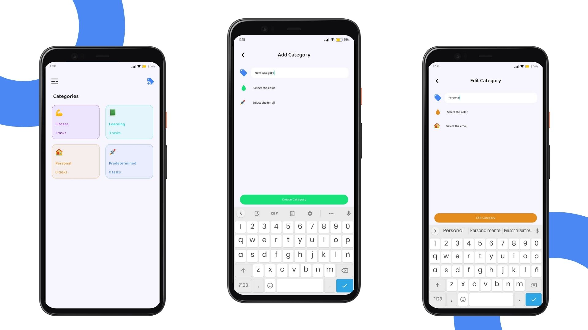

# Daily App with Vue Native, React Native and Firebase   

## Table of Content

- [About The Project](#about-the-project)
  - [Description](#description)
  - [Built With](#built-with)
- [Installation](#installation)
- [Usage](#usage)
- [Contact](#contact)

## About The Project






## Description

This is a complete Mobile App project I made with Vue Native, React Native and Firebase.

The project deals with an application of tasks, which can be divided into categories, you can also add, edit and delete tasks and categories, it also has user authentication through Google or Email, these users can edit their profile, upload photos, delete your account from the application, etc.

## Built With

[](https://vue-native.io)

[](https://reactnative.dev)

[](https://docs.expo.dev)

[](https://firebase.google.com)

## Installation

1. Clone the repo and change "my-project" to your project name.

```sh
  git clone https://github.com/josemiguel02/Daily-App-Vue-Native.git ./my-project
```

2. Go to the project directory

```sh
  cd my-project
```

3. Install NPM packages

```sh
  npm install
```

4. Add the following environment variables to your .env file

`webClientId`

5. Add **google-services.json** file in the root of the project and in the **android\app** folder

## Usage

Run the project in development

```sh
  npm start
```

Run on Android

```sh
  npm run android
```

Run on IOS

```sh
  npm run ios
```

Bundle for production

```sh
  npm run bundle
```

## Contact

- Gmail - [josemidev24@gmail.com](mailto:josemidev24@gmail.com)
- Instagram - [@jmdp.02](https://www.instagram.com/jmdp.02)
